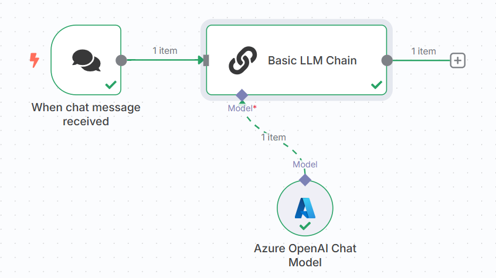

[⬅️ Back to Lab 0 - Installation](./Lab%200%20-%20Installation.md) | [➡️ Go to Lab 2 - Chat with Live Data using AI Agent](./Lab%202%20-%20Chat%20with%20Live%20Data%20using%20AI%20Agent.md)

# Lab 1 – LLM Chain Chat with Chat Trigger

## 🎯 Objective
In this lab, you'll:
- Set up a real-time chat experience in n8n
- Use the `Chat Trigger`, `LLM Chain`, and `Respond to Chat` nodes
- Learn how system prompts and user messages work together

## 🔧 Prerequisites
Make sure:
- Chat UI is enabled in your n8n instance
- You’ve connected an LLM provider (OpenAI, Groq, etc.)
- LLM functionality is turned on in settings

## 🛠 Step-by-Step Instructions


### Step 1: Create a Workflow
1. Open n8n dashboard.
2. Click **“Create Workflow”** and name it: `Lab 1 – LLM Chat`.

### Step 2: Add a `On chat message Trigger` Node
- This listens for incoming messages from the Chat UI.

### Step 3: Add a `Basic LLM Chain` Node
1. Select the node under the AI section.
2. Add a **System Prompt**:
    ```
    You are a friendly assistant who responds clearly and helpfully.
    ```
### Step 4: Set up `Language Model` connected to the LLM Chain
1. Select your preferred model provider
2. Configure your model credentials (e.g., OpenAI or Groq).

### Step 5: Test
1. Open the Chat UI.
2. Ask questions like:
    ```
    What's the meaning of life?
    ```
3. Receive responses from the LLM.


## **Try these System Prompts**

- "You are a sarcastic assistant who answers everything with dry humor.

- "You explain everything as if your audience is a 3-year-old."

- "You respond in the style of Willian Shakespeare"

[⬅️ Back to Lab 0 - Installation](./Lab%200%20-%20Installation.md) | [➡️ Go to Lab 2 - Chat with Live Data using AI Agent](./Lab%202%20-%20Chat%20with%20Live%20Data%20using%20AI%20Agent.md)
