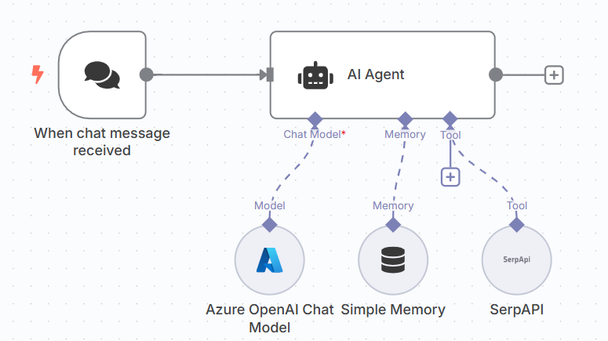

[⬅️ Back to Lab 1 - Simple LLM Chain](./Lab%201%20-%20Simple%20LLM%20Chain.md) | [➡️ Go to Lab 3 - Chat with SQL Agent](./Lab%203%20-%20Chat%20with%20SQL%20Agent.md)

# Lab 2 – Chat with Live Data using AI Agent + SerpAPI

## 🎯 Objective
Learn how to use AI Agent node with:
- A real-time tool (SerpAPI)
- Simple memory for multi-turn chat

## 🔧 Prerequisites
- A [SerpAPI](https://serpapi.com/) API Key

## 🛠 Step-by-Step Instructions

### Step 1: Create a Workflow
1. Open n8n dashboard.
2. Click **“Create Workflow”** and name it: `Lab 2 – AI Agent Chat`.

### Step 2: Add a `On chat message Trigger` Node
- This listens for incoming messages from the Chat UI.

### Step 3: Add an `AI Agent` Node
1. Select the node under the AI section.
2. Add a **System Prompt**:
    ```
    You are a friendly assistant who responds clearly and helpfully. Use the search tool if you need real-time info.
    ```
### Step 4: Set up `Language Model` connected to the Agent
1. Select your preferred model provider
2. Configure your model credentials (e.g., OpenAI or Groq).

### Step 5: Set up Agent's Memory
- Memory lets the agent remember things across messages - just like a human conversation.
- This allow the agent to handle muti-turn conversations.

1. Add `Simple Memory` and connect to the AI Agent

### Step 6: Set up Agent's Tool
- Tools let the AI Agent do things it cannot do on its own - like search the internet, run calculations, query database, or access your APIs

1. In today's lab we will use SerpAPI (Google Search API) as our tool to search real time data.
2. Add `SerpAPI` in Tools UI, enter the API key

### Step 7: Test
1. Open the Chat UI.
2. Ask questions like:
    ```
    "What's the current weather in Bangkok?"
    ```
3. Receive responses from the LLM.

[⬅️ Back to Lab 1 - Simple LLM Chain](./Lab%201%20-%20Simple%20LLM%20Chain.md) | [➡️ Go to Lab 3 - Chat with SQL Agent](./Lab%203%20-%20Chat%20with%20SQL%20Agent.md)