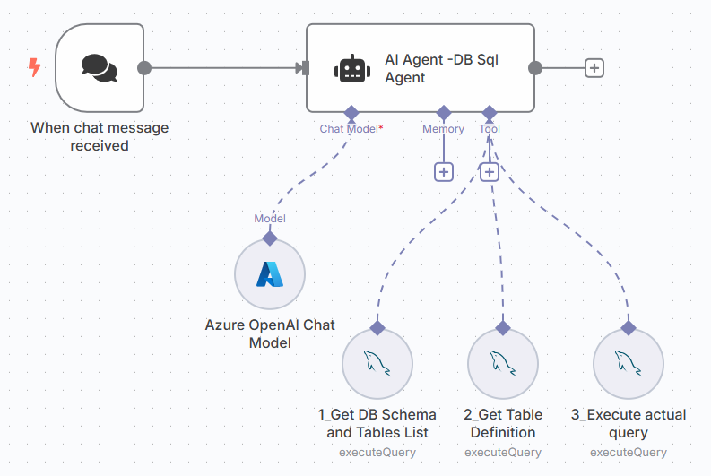

[⬅️ Back to Lab 2 - Chat with Live Data using AI Agent](./Lab%202%20-%20Chat%20with%20Live%20Data%20using%20AI%20Agent.md) | [➡️ Go to Lab 4 - Chat with Excel](./Lab%204%20-%20Chat%20with%20Excel.md)

# Lab 3 – Chat with SQL Agent

## 🎯 Objective
In this lab, you will build an AI-powered SQL Agent in n8n that:
- Receives natural language question.
- Uses a fixed sequence of tools in an AI Agent to:

   1. Get DB schema
   2. Get table definition
   3. Execute the final query

## 🔧 Prerequisites
- Set up a local MySQL database with Chinook sample DB. Refer to [Setup: Local MySQL Database with Chinook Sample Data](/data/mysqldb_setup.md)

## Introduction
The database you will use in this challenge is Chinook Database. The Chinook data model represents a digital media store, including tables for artists, albums, media tracks, invoices and customers.


## 🛠 Step-by-Step Instructions

### Step 1: Create a Workflow
1. Open n8n dashboard.
2. Click **“Create Workflow”** and name it: `Lab 3 – SQL Agent Chat`.

### Step 2: Add a `On chat message Trigger` Node
- This listens for incoming messages from the Chat UI.

### Step 3: Add an `AI Agent` Node
1. Select the node under the AI section.
2. Add a **System Prompt**:
    ```
    You are an agent designed to interact with a SQL database.
    Given an input question, create a syntactically correct SQL query to run, then look at the results of the query and return the answer. Unless the user specifies number of examples they wish to obtain, always limit your query to at most 10 results.

    You can order the results by a relevant column to return the most interesting examples in the database. Never query for all the columns from a specific table, only ask for the relevant columns given the question.

    You MUST double check your query before executing it. If you get an error while executing a query, rewrite the query and try again.

    DO NOT make any DML statements (INSERT, UPDATE, DELETE, DROP etc.) to the database.

    To start you should ALWAYS look at the tables in the database to see what you can query. Do NOT skip this step.
    Then you should query the schema of the most relevant tables.

    You must use the sequence of tools in order 1_Get DB Schema and Tables List  , 2_Get Table Definition, 3_Execute actual query

    ## Tools

    - 1_Get DB Schema and Tables List
    Lists all the tables in database with its schema name

    - 2_Get Table Definition
    Gets the table definition from db using table name and schema name

    - 3_Execute actual query
    Executes any sql query generated by AI

    ```
### Step 4: Set up `Language Model` connected to the Agent
1. Select your preferred model provider
2. Configure your model credentials (e.g., OpenAI or Groq).

### Step 5: Set up Agent's Memory
- Memory lets the agent remember things across messages - just like a human conversation.
- This allow the agent to handle muti-turn conversations.

1. Add `Simple Memory` and connect to the AI Agent

### Step 6: Add SQL Tool Nodes
#### Tool 1: Get Schema and Tables List
- **Tool Type**: MySQL tool
- **Node Name**: 1_Get DB Schema and Tables List
- **Operation**: Execute SQL
- **Query**:
    ```sql
    SELECT
    table_schema,
    table_name
    FROM
        information_schema.tables
    WHERE
        table_type = 'BASE TABLE'
        AND table_schema NOT IN ('mysql', 'information_schema', 'performance_schema', 'sys')
    ORDER BY
        table_schema, table_name;
    ```

#### Tool 2: Get Table Definition
- **Tool Type**: MySQL tool
- **Node Name**: 2_Get Table Definition
- **Operation**: Execute SQL
- **Query**:
    ```sql
    SELECT
        c.column_name,
        c.column_comment,
        c.data_type,
        c.is_nullable,
        c.column_default,
        tc.constraint_type,
        kcu.table_name AS referenced_table,
        kcu.column_name AS referenced_column
    FROM
        information_schema.columns c
    LEFT JOIN
        information_schema.key_column_usage kcu
        ON c.table_name = kcu.table_name
        AND c.column_name = kcu.column_name
    LEFT JOIN
        information_schema.table_constraints tc
        ON kcu.constraint_name = tc.constraint_name
        AND tc.constraint_type = 'FOREIGN KEY'
    WHERE
    c.table_name = '{{ $fromAI("table_name") }}'
    AND c.table_schema = '{{ $fromAI("schema_name") }}'
    ORDER BY
        c.ordinal_position;
    ```
    [Documentation- Let AI specify the tool parameters](https://docs.n8n.io/advanced-ai/examples/using-the-fromai-function/#let-ai-specify-the-tool-parameters)

#### Tool 3: Execute Final Query
- **Tool Type**: MySQL tool
- **Node Name**: 3_Execute actual query
- **Operation**: Execute SQL
- **Query**:
    ```
    {{ $fromAI("sql_query", "SQL Query") }}
    ```

### Step 7: Test
1. Open the Chat UI.
2. Ask questions like:
    ```
    "Which albums have the highest number of tracks?"

    "What is the total sales amount for the “Rock” genre?"

    "Which customer has the highest total invoice amount?"

    "Which employees have no associated invoices?"
    ```
3. Receive responses from the LLM.

[⬅️ Back to Lab 2 - Chat with Live Data using AI Agent](./Lab%202%20-%20Chat%20with%20Live%20Data%20using%20AI%20Agent.md) | [➡️ Go to Lab 4 - Chat with Excel](./Lab%204%20-%20Chat%20with%20Excel.md)
