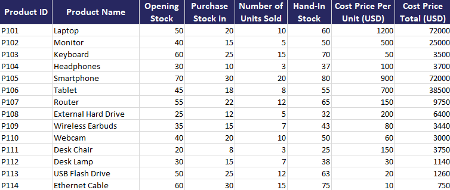
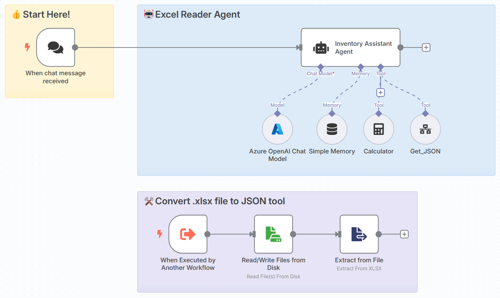

[⬅️ Back to Lab 3 - Chat with SQL Agent](./Lab%203%20-%20Chat%20with%20SQL%20Agent.md) | [➡️ Go to Lab 5 - Multi-Agent](./Lab%205%20-%20Multi-Agent.md)

# Lab 4 – Chat with Excel - Inventory Assistant

## 🎯 Objective
In this lab, you will build an AI Chat Agent that:
- Receives natural language question.
- Read data from Excel spreadsheet
- Uses tools like calculations

## 🔧 Prerequisites
- Download data file: [Inventory-Records-Sample-Data.xlsx](/data/Inventory-Records-Sample-Data.xlsx)

## Introduction
The excel file you will use in this challenge is the inventory records sample data which contains inventory records with the following column:
- `product_id`: unique identifier for the product
- `product_name`: the name of the product
- `opening_stock`: number of units at the start of the period
- `purchase_stockin`: number of units added during the period
- `units_sold`: number of units sold during the period
- `hand_in_stock`: current stock on hand
- `cost_price_per_unit`: cost price of one unit
- `cost_price_total`: total cost price for the units



## 🛠 Step-by-Step Instructions


### Step 1: Create a Workflow
1. Open n8n dashboard.
2. Click **“Create Workflow”** and name it: `Lab 4 – Excel Agent Chat`.

### Step 2: Add a `On chat message Trigger` Node
- This listens for incoming messages from the Chat UI.

### Step 3: Add an `AI Agent` Node
1. Select the node under the AI section.
2. Add a **System Prompt**:
    ```
    You are an expert inventory assistant.

    #TOOLS
    - Get_JSON: you ALWAYS need to run this one first to get JSON data
    - Calculator: you might need it to do any calculations related to the data

    - `product_id`: unique identifier for the product
    - `product_name`: the name of the product
    - `opening_stock`: number of units at the start of the period
    - `purchase_stockin`: number of units added during the period
    - `units_sold`: number of units sold during the period
    - `hand_in_stock`: current stock on hand
    - `cost_price_per_unit`: cost price of one unit
    - `cost_price_total`: total cost price for the units

    Your task is to answer user questions **based solely on this data**.

    You can:
    - Filter data by product name or ID
    - Calculate totals, sums, averages, or trends based on sales or stock
    - Identify how many units of a product were sold, in stock, or purchased
    - Provide summaries in clear, non-technical language

    Rules:
    - Always use only the data in `data` — do not guess or invent information
    - If you cannot answer from the data, ask for clarification
    - Do not return raw JSON or code unless requested

    Examples:
    - "How many laptops were sold?" → Sum `units_sold` for products with `product_name` containing "laptop"
    - "What is the current stock of product 123?" → Report `hand_in_stock` for `product_id` 123
    - "What was the total cost price of phones purchased?" → Sum `cost_price_total` for products with "phone" in the name

    Answer clearly and helpfully using the data provided.
    ```
### Step 4: Set up `Language Model` connected to the Agent
1. Select your preferred model provider
2. Configure your model credentials (e.g., OpenAI or Groq).

### Step 5: Set up Agent's Memory
- Memory lets the agent remember things across messages - just like a human conversation.
- This allow the agent to handle muti-turn conversations.

1. Add `Simple Memory` and connect to the AI Agent

### Step 6: Add Tool Nodes to the AI Agent
#### Tool 1: Calculator
- **Tool Type**: Calculator

This allows calculations inside the AI agent.

#### Tool 2: Get JSON
- **Tool Type**: Call n8n Workflow Tool
- **Node Name**: Get_JSON
- **Source**: Database
- **Workflow**: `Lab 4 – Excel Agent Chat` (This is the lab name you set in Step 1)

### Step 7: Create Get JSON Tool Workflow
1. Add new a node trigger: `When executed by another workflow`
    - Input data mode: Accept all data
2. Add `Read/Write Files from Disk`
    - Operation: `Read File(s) From Disk`
    - Select you local file path to `Inventory-Records-Sample-Data.xlsx`
3. Add `Extract From File`
    - Operation: `Extract From XLSX`
    - Input Binary Field: `data`

### Step 7: Test
1. Open the Chat UI.
2. Ask questions like:
    ```
    "How many laptops were sold?"

    "How much Laptop and Monitor were sold and how much money they earned in total"

    "Which product is likely to be the best selling in the next cycle?"
    ```
3. Receive responses from the LLM.

[⬅️ Back to Lab 3 - Chat with SQL Agent](./Lab%203%20-%20Chat%20with%20SQL%20Agent.md) | [➡️ Go to Lab 5 - Multi-Agent](./Lab%205%20-%20Multi-Agent.md)