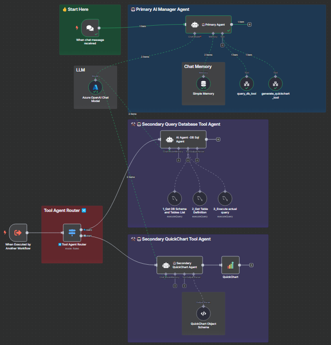
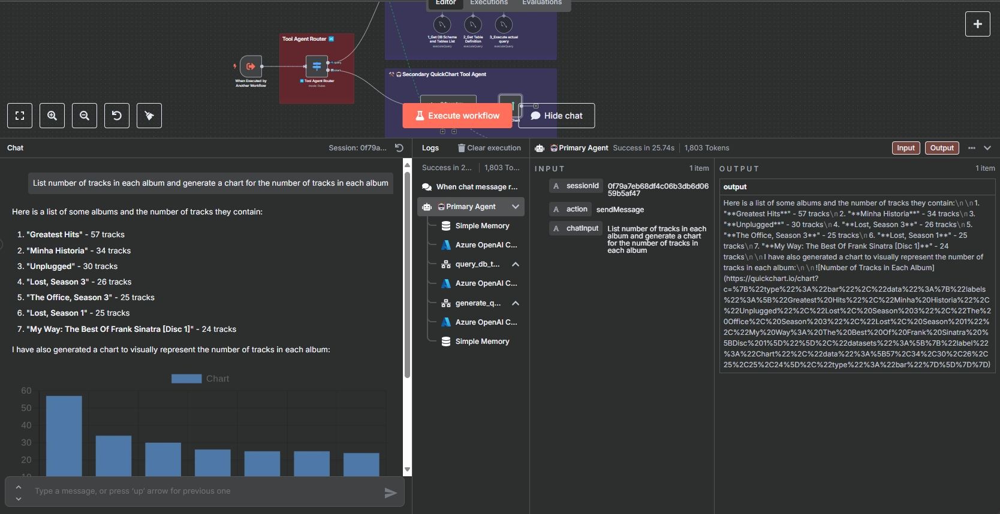

[⬅️ Back to Lab 4 - Chat with Excel](./Lab%204%20-%20Chat%20with%20Excel.md)

# Lab 5 - Multi-Agent (Stretch Goal)

## 🎯 Objective

In this lab, you'll:

- Apply multi-agent architecture to create a more complex workflow
- Use AI agents to handle different tasks like querying databases and generating charts
- Learn how to integrate multiple AI agents to work together in a single workflow
- Understand the importance of memory integration for context-aware interactions
- Utilize the QuickChart node to visualize data from database queries

## 🔧 Prerequisites

- n8n setup locally or on a server.
- A MySQL-compatible database (e.g., Postgres or Microsoft SQL).
- API credentials for any LLM model you would like to use.

## Overview

In this lab, you will create a multi-agent workflow that allows users to interact with a database using natural language. The workflow will include an AI-powered chat interface that can query a MySQL database and generate charts based on user requests. This setup will enable users to retrieve insights and visualize data without needing to write SQL queries or configure charts manually.

### What problem does this solve?

It simplifies data exploration by combining AI Agent with database querying and chart generation. Users can interact with their database using natural language, retrieve insights, and visualize data without manual SQL queries or chart configuration.

### What this workflow does

1. AI-Powered Chat Interface:

   - Accepts natural language prompts to query databases or generate charts.
     Routes user requests through a tool agent system to determine the appropriate action (query or chart).

2. Database Querying:

   - Executes SQL queries on MySQL databases based on user input.
   - Retrieves schema information, table definitions, and specific data records.

3. Dynamic Chart Generation:

   - Uses QuickChart node to create bar charts, line charts, or other visualizations from database records.
   - Outputs a shareable chart URL or JSON configuration for further customization.

4. Memory Integration:
   - Maintains chat history using Simple memory nodes, enabling context-aware interactions.
   - Workflow diagram showcasing AI agents, database querying, and chart generation paths.

## 🛠 Step-by-Step Instructions



### Step 1: Add "On chat message Trigger" Node

- This node listens for incoming messages from the Chat UI.

### Step 2: Add an "AI Agent" Node

1. Select the node under the AI section.
2. Add a **System Prompt**:

   ```
   You are a helpful assistant that answers the users questions by using the tools provided.

   ## TOOLS
   - query_database_tool: Use this tool to query the database
   - generate_chart_tool: Use this tool to generate a chart with QuickChart

   Always provide the results of the database query and the link for the chart when applicable.
   ```

- This node will handle the incoming chat messages and route them to the appropriate action (query or chart generation).

### Step 3: Set up `Chat Model` connected to the Agent

1. Select your preferred model provider
2. Configure your model credentials (e.g., OpenAI or Groq).

### Step 4: Set up Agent's Memory

- Memory lets the agent remember things across messages - just like a human conversation.
- This allow the agent to handle muti-turn conversations.

1. Add `Simple Memory` and connect to the AI Agent

### Step 5: Create and configure the "When Executed By Workflow" trigger node to accept inputs from the previous nodes.

- Ensure it can receive following parameters from both database queries and chart generation:
  - `user_prompt`: String
  - `route`: String
  - `db_records`: String

### Step 6: Add "Call n8n Workflow" tool for the "query_database_tool" and "generate_chart_tool" to execute the respective actions based on user input. Ensure to configure the tool with the necessary parameters for database queries and chart generation.

- Add workflow inputs for the "query_database_tool" as follows:

  - name: `query_database_tool`
  - description: `Use this tool to query the database`
  - Source: Database
  - Workflow: From list -> Choose current workflow (If you don’t see your workflow listed, please return to the previous page, click “Save,” and then repeat this step.)
  - user_prompt: `{{ $('When chat message received').item.json.chatInput }}` (Please make sure to choose expression instead of fixed type)
  - route: `query_database_tool`
  - db_records: Leave it empty

- Add workflow inputs for the "generate_chart_tool" as follows:
  - name: `generate_chart_tool`
  - description: `Use this tool to generate a chart with QuickChart`
  - Source: Database
  - Workflow: From list -> Choose current workflow (If you don’t see your workflow listed, please return to the previous page, click “Save,” and then repeat this step.)
  - user_prompt: `{{ $('When chat message received').item.json.chatInput }}` (Please make sure to choose expression instead of fixed type)
  - route: `generate_chart_tool`
  - db_records: Set it as defined automatically by the model -> click on `add a description` under db_records input -> add following description: `The database records`

### Step 7: Add "Switch" Node to route the workflow based on the action type (query or chart generation).

- In the Switch Node, set up two routing rules based on the `{{ $json.route }}` parameter:
  - Rule 1: If `{{ $json.route }}` is equal to `query_database_tool`, execute the database query.
  - Rule 2: If `{{ $json.route }}` is equal to `generate_chart_tool`, generate the chart using QuickChart.

### Step 8: Copy SQL agent from Lab 3 and link it to the Switch Node for the `query_database_tool` route.

- Follow these steps to modify your SQL AI Agent:

  - Remvoe `Simple Memory` from Agent memory
  - Set `Source for Prompt (User Message)` to `Define below`
  - Add following prompt to Prompt (User Message):

  ```txt
  Please answer non-technical way.
  ====
  USER QUESTION: {{ $json.user_prompt }}.
  ```

- This node will execute SQL queries based on user input.

### Step 9: Add another agent for the `generate_chart_tool` route.

- Create new "AI Agent" Node name it `Chart Builder Agent`.
- Set `Source for Prompt (User Message)` to `Define below`
- Add following prompt to Prompt (User Message):

  ```txt
  Your task is to generate a Chart.js configuration object with the following specifications:
  - Chart type: bar unless otherwise indicated
  - Labels: Use the ML # from each record unless otherwise indicated
  - Show bar for list price if not otherwise indicated
  - Return only the raw JSON object without code fences or explanations

  This is the user prompt: {{ $json.user_prompt }}
  This is the result of the SQL query: {{ $json.db_records }}
  ```

- Click enable `Require Specific Output Format`.

### Step 10: Set up `Chat Model` connected to the Chart Builder Agent

1. Select your preferred model provider
2. Configure your model credentials (e.g., OpenAI or Groq).

### Step 11: Setup Structured Output Parser for Chart Builder Agent

- Add `Structured Output Parser` as the `Chart Builder Agent` of Chart Builder Agent.
- Select `Structured Output Parser` as Schema Type.
- Add following JSON to JSON Example:

  ```json
  {
    "output": {
      "type": "bar",
      "data": {
        "labels": ["ML #1", "ML #2", "ML #3"],
        "datasets": [
          {
            "label": "List Price",
            "data": [1000000, 1200000, 1100000],
            "backgroundColor": "rgba(75, 192, 192, 0.2)"
          }
        ]
      },
      "options": {
        "scales": {
          "y": {
            "min": 0,
            "max": 1500000
          }
        }
      }
    }
  }
  ```

### Step 13: Connect generate Agent to the Switch Node at rule `generate_chart_tool`.

### Step 14: Create chart using "QuickChart" node.

- This agent is use to generate chart base on incomming JSON from Chart Builder Agent output.
- Add the "QuickChart" Node and connect it to Chart Builder Agent.
- Configure the QuickChart Node with the following settings:
  - Chart type: `{{ $json.output.type }}` (Please make sure to choose expression instead of fixed type)
  - Add Labels: From Array
  - Labels Array: `{{ $json.output.data.labels }}` (Please make sure to choose expression instead of fixed type)
  - Data: `{{ $json.output.data.datasets[0].data }}` (Please make sure to choose expression instead of fixed type)

### Step 15: Hit `Save` before testing.

Final step: Try chat with following questions:

- "List number of track in each album" - This should run only SQL Agent as the input is not asking for generating chart
- "List number of tracks in each album, generate a bar chart and provide clickable link to the image" - This should also call chart generator agent to generate chart

If you're using gpt-4.1 or other compartible to it, unfortunately, you will get only the link to chart image like below image.


If your using chat model that is able to generate an image like gpt-4o or better chat model, you can try asking with mesasge like "List number of tracks in each album, generate a bar chart". You will see chart image display in the response.



## Bonus Challenge

- Automatically generate a chart based on the SQL query results.

## Conclusion

In this lab, you have successfully created a multi-agent workflow that allows users to interact with a database using natural language. You learned how to integrate AI agents for querying databases and generating charts, maintain chat history for context-aware interactions, and visualize data using QuickChart. This setup simplifies data exploration and enables users to gain insights without needing to write SQL queries or configure charts manually.

## Key takeaways

- Multi-agent architecture allows for complex workflows that can handle various tasks.
- AI agents can be used to query databases and generate charts based on user input.
- Memory integration is crucial for maintaining context in conversations.
- QuickChart can be used to visualize data from database queries, making insights more accessible.

[⬅️ Back to Lab 4 - Chat with Excel](./Lab%204%20-%20Chat%20with%20Excel.md)